# Architecture

Artaic Print Planner is a static, local-first browser application for uploading G-code, tracking filament inventory, planning printer schedules, and monitoring scheduled production work. It runs entirely from `index.html` with JavaScript modules in `src/` and persists data in browser `localStorage`.

## Application Map

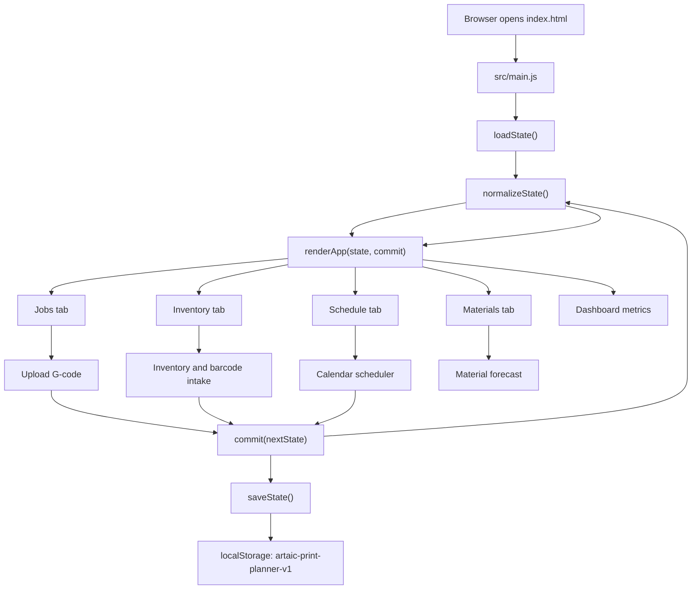

## Module Responsibilities

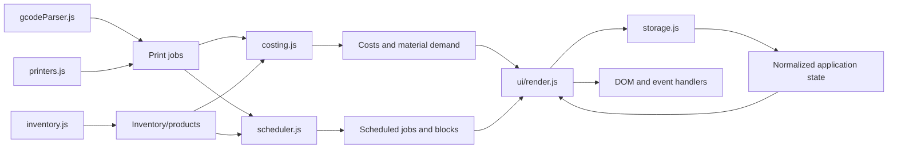

- `src/main.js`: Starts the app, owns the `commit()` loop, and re-renders after every state change.
- `src/modules/storage.js`: Loads, saves, imports, exports, clears, and normalizes state.
- `src/modules/gcodeParser.js`: Parses uploaded `.gcode`, `.bgcode`, `.gco`, and `.gc` files into queued print jobs.
- `src/modules/printers.js`: Defines default printers and detects printer assignment from metadata or filenames.
- `src/modules/inventory.js`: Creates inventory/products, normalizes spool fields, handles barcode products, forecasts inventory, and produces material warnings.
- `src/modules/costing.js`: Calculates required material, available material, job costs, and material costs.
- `src/modules/scheduler.js`: Owns schedule models, monthly/weekly calendar building, queue-to-schedule commits, changeover placement, servicer availability, start/auto-complete behavior, and warnings.
- `src/ui/render.js`: Renders all tabs, dashboard metrics, forms, Gantt charts, warnings, and binds user events.
- `src/styles.css`: Provides all static styling for dashboard cards, queues, inventory, scheduler controls, Gantt lanes, and responsive behavior.

## State Shape

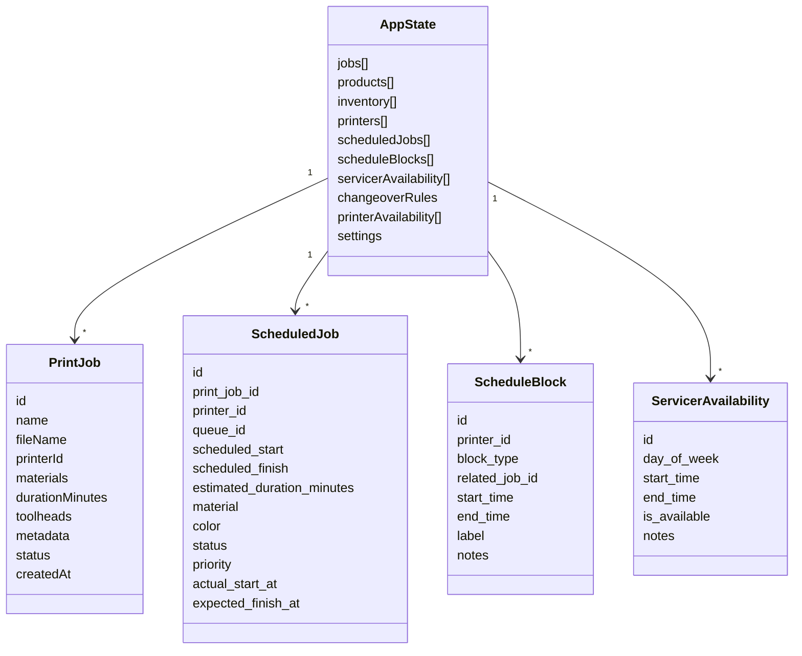

The state is saved as JSON in `localStorage` under `artaic-print-planner-v1`. Import/export use the same normalized state shape.

## Render And Commit Loop

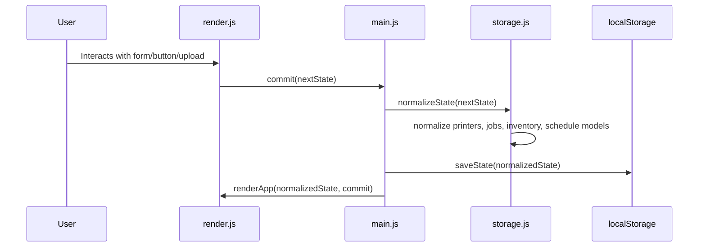

The app does not use a framework. Each commit replaces rendered HTML and rebinds event listeners.

## G-code Upload Flow

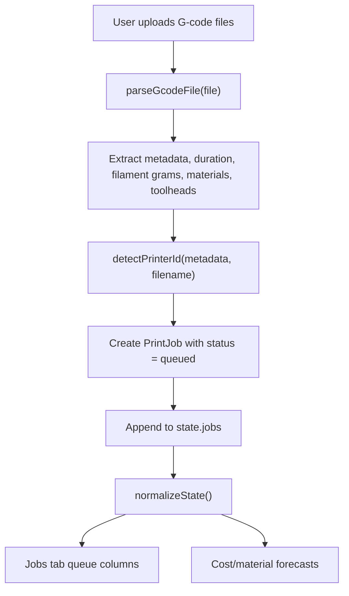

Uploaded jobs start as `queued`. They are not scheduled or printed automatically.

## Inventory And Barcode Flow

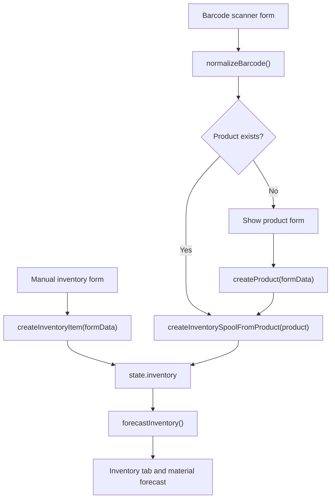

Barcode intake is local-only. Saved products make future scans create inventory spools immediately.

## Costing And Material Forecast Flow

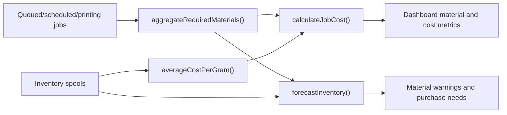

Cost and forecast calculations are previews. The current app does not decrement physical inventory when a print completes.

## Scheduling Workflow

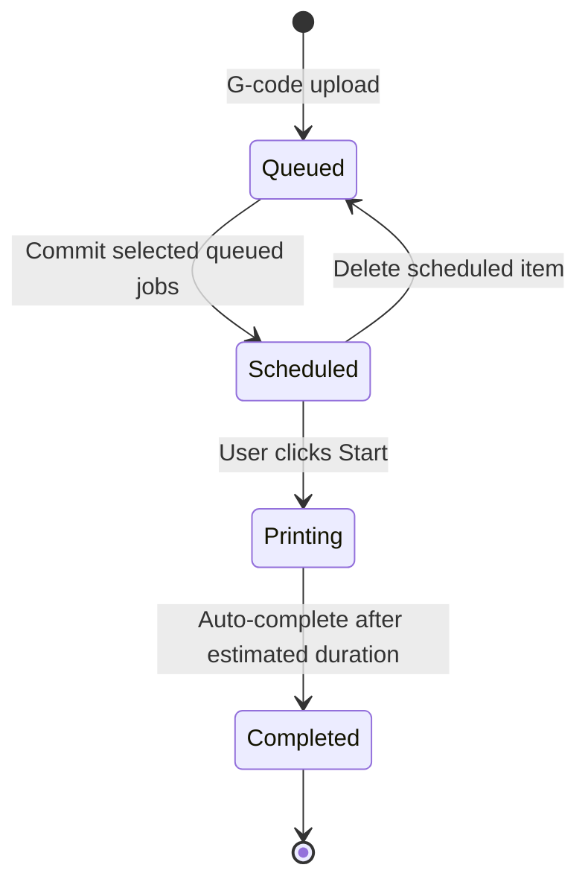

Committing jobs places them into the production calendar. It does not start the physical printer.

## Queue To Calendar Scheduling Flow

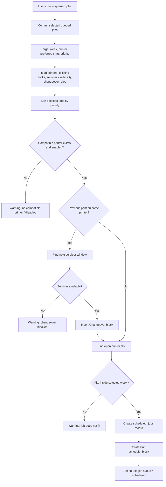

Warnings are shown on the Schedule page. Jobs that cannot be placed remain queued.

## Schedule Views

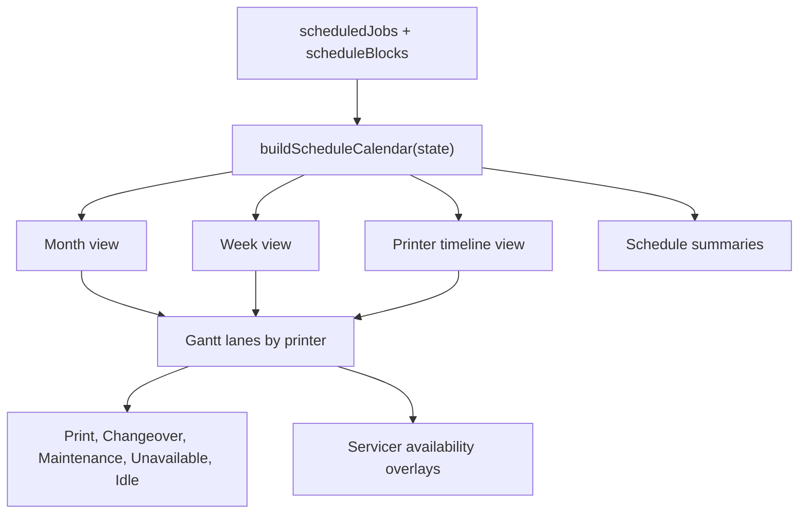

The primary visual is the month Gantt. Week view narrows the visible date range while preserving the same lane/block model.

## Scheduling Rules

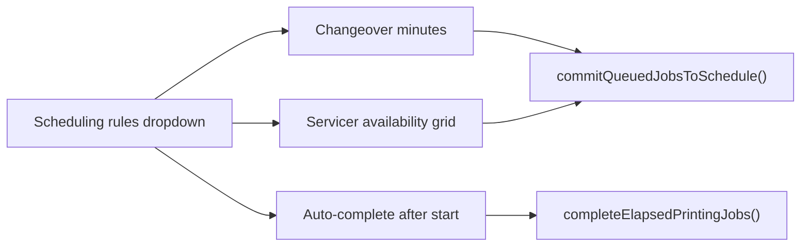

The servicer grid stores one availability window per weekday. Changeovers are delayed until an available servicer window exists.

## Start And Auto-Complete Flow

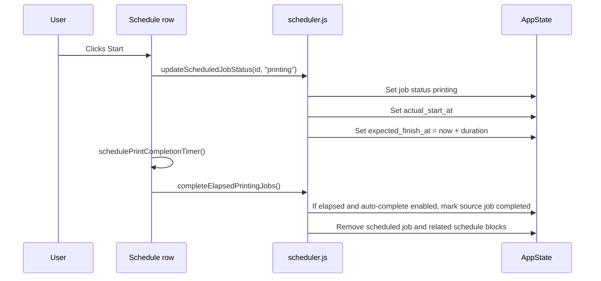

If `Auto-complete after start` is disabled, printing jobs remain active and are not removed automatically.

## UI Structure

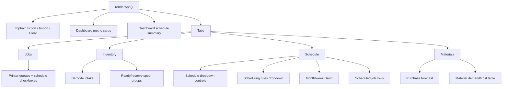

## Local-First Boundaries

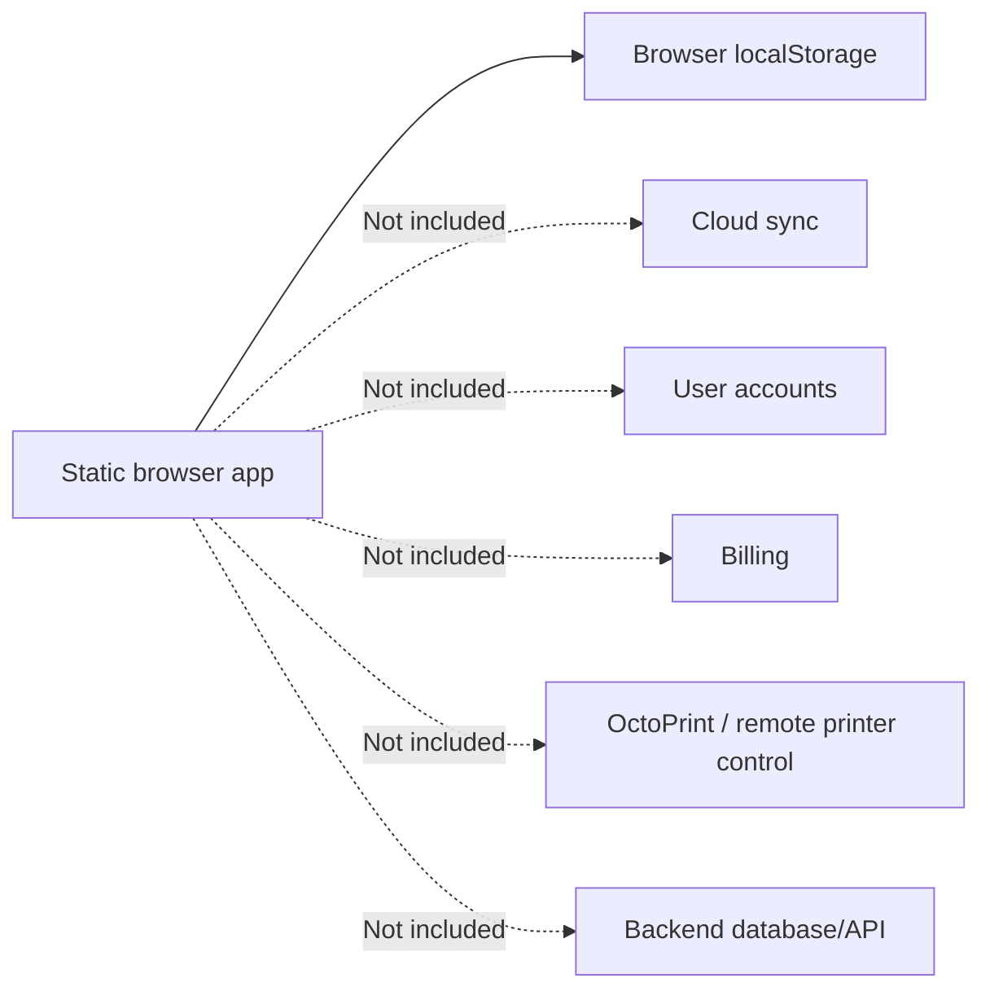

Current boundaries:

- No backend server.
- No authentication.
- No cloud sync.
- No billing.
- No remote printer control.
- No OctoPrint integration.
- Uploaded files stay in the browser.
- Schedule state is planning state, not printer execution state.

## Current Production Lifecycle

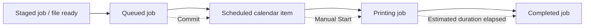

The application is designed around the distinction between planned work and active physical printer work. `Scheduled` means a job is on the calendar. `Printing` means the user manually started it.
