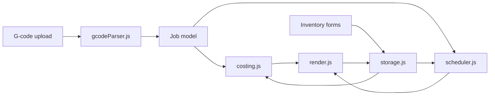

# Architecture

Artaic Print Planner Version 1 is a static browser application.

## Runtime Model

## Modules

- `gcodeParser.js`: Converts uploaded G-code text into normalized print jobs.
- `inventory.js`: Normalizes inventory records and calculates value/warnings.
- `costing.js`: Matches job material requirements to inventory costs.
- `scheduler.js`: Produces recommended print order, printer assignment, and utilization metrics.
- `storage.js`: Owns browser persistence and export/import snapshots.
- `render.js`: Owns DOM rendering and event binding.

## Version 1 Boundaries

- No backend.
- No authentication.
- No shared inventory database.
- No file upload leaves the browser.
- LocalStorage is the persistence layer.

## Future Expansion Path

The local storage interface should become the contract for future API calls. A backend can provide shared job state, inventory locking, user permissions, production history, and ERP synchronization while preserving the job, inventory, costing, and scheduling models already used in the browser.
